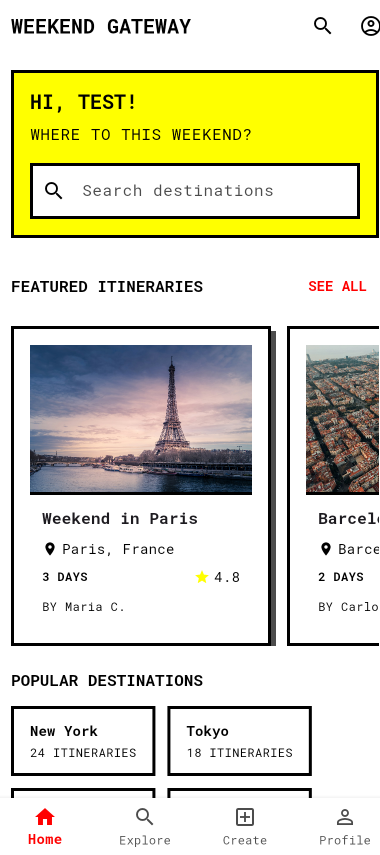

# Weekend Gateway 🏖️


<p align="center">
  
</p>

**Weekend Gateway** is an open-source, community-driven travel itinerary sharing application with a distinct neo-brutalist design. Plan your weekends and trips, share with the community, and discover amazing destinations curated by fellow travelers.

<p align="center">
  
  
  
</p>

## 🚀 Features

- **Neo-brutalist Design** - Bold, high-contrast visuals with a raw aesthetic
- **Community-Driven Content** - Discover and share travel itineraries
- **Interactive Trip Plans** - View detailed day-by-day itineraries
- **Discovery & Filters** - Search by location, price range, duration, and more
- **Upvoting & Commenting** - Engage with the community on their itineraries
- **User Profiles** - Track created and saved itineraries
- **Responsive Design** - Fully functional on mobile and web

## ⬇️ Download

You can download the latest version of Weekend Gateway from the [Releases](https://github.com/yourusername/weekend_gateway/releases) page.

## 🏗️ Tech Stack

- **Frontend**: Flutter
- **Backend**: Supabase (Auth, Storage, Database)
- **State Management**: Provider
- **UI/UX**: Flutter Animate for animations

## 📝 Getting Started

### Prerequisites

- Flutter SDK (3.0+)
- Dart SDK (3.0+)
- A Supabase account and project

### Setup

1. Clone the repository
```bash
git clone https://github.com/yourusername/weekend_gateway.git
```

2. Navigate to the project directory
```bash
cd weekend_gateway
```

3. Install dependencies
```bash
flutter pub get
```

4. Create a `.env` file in the root directory with your Supabase credentials:
```
SUPABASE_URL=your_supabase_url
SUPABASE_ANON_KEY=your_supabase_anon_key
```

5. Run the app
```bash
flutter run
```

## 🔮 Upcoming Features

We're actively working on enhancing Weekend Gateway with the following features:

1. **Collaborative Planning** - Invite friends to collaborate on trip planning
2. **Fork & Customize** - Fork and personalize anyone's itinerary
3. **Chat Groups** - Dedicated group chats for specific trip plans
4. **Trip Badges & Achievements** - Earn badges based on travel milestones
5. **AI-Powered Itinerary Generation** - Create personalized itineraries using AI
6. **Location Precision** - Add specific coordinates for trip locations
7. **Enhanced Media Sharing** - Add photos to others' itineraries and reviews

## 🤝 Contributing

Contributions, issues, and feature requests are welcome! Feel free to check the [issues page](https://github.com/yourusername/weekend_gateway/issues).

1. Fork the Project
2. Create your Feature Branch (`git checkout -b feature/AmazingFeature`)
3. Commit your Changes (`git commit -m 'Add some AmazingFeature'`)
4. Push to the Branch (`git push origin feature/AmazingFeature`)
5. Open a Pull Request

## 📱 Screenshots

| Home Screen | Trip Details | Search & Filters |
| :---: | :---: | :---: |
|  |  |  |

## 📄 License

This project is licensed under the MIT License - see the LICENSE file for details.

## 📧 Contact

Project Link: [https://github.com/yourusername/weekend_gateway](https://github.com/yourusername/weekend_gateway)

---

<p align="center">Made with ❤️ for weekend explorers everywhere</p>
